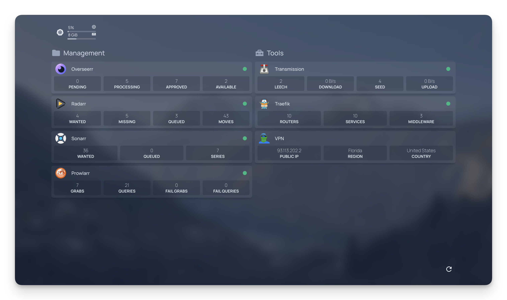

# Homelab Kubernetes Cluster

This repository contains the Terraform configuration for setting up a homelab Kubernetes cluster with various applications and services. The setup includes reverse proxy, media management, metrics server, and more.



## 📚 Table of Contents

- [Prerequisites](#🧰-prerequisites)
- [Project Structure](#🗂️-project-structure)
- [Modules](#📦-modules)
- [Configuration](#⚙️-configuration)
- [Usage](#🚀-usage)
- [More documentation](#📖-more-documentation)

## 🧰 Prerequisites

- [Terraform](https://www.terraform.io/downloads.html) v1.10.2 or later.
- [kubectl](https://kubernetes.io/docs/tasks/tools/install-kubectl/) configured to access your Kubernetes cluster.
  - Your Kubernetes cluster should support a LoadBalancer service type.
- [Cloudflare](https://www.cloudflare.com/) account.
  - Ensure your domain is managed by Cloudflare.
- S3-compatible object storage.
  - Ensure you have an S3-compatible object storage for Terraform state management.

## 🗂️ Project Structure

```
homelab/
├── config/               # Configuration files loaded by Kubernetes (No files will be written here, only read)
|  ├── buildarr/
|  ├── homepage/
|  ├── homepage-public/
|  ├── scripts/
|  └── traefik/
├── modules/              # Terraform modules (see below)
|  ├── cloudflare/
|  ├── cloudflared/
|  ├── homepage/
|  ├── media-management/
|  ├── metrics-server/
|  ├── pi-hole/
|  ├── reverse-proxy/
|  └── utils/
├── .env.template         # Environment variables template
├── .gitignore            # Git ignore file
├── .terraform-docs.yml   # Terraform docs configuration
├── .terraform.lock.hcl   # Terraform lock file
├── .tflint.hcl           # TFLint configuration
├── main.tf               # Main Terraform configuration
├── Makefile              # Makefile for Terraform commands
├── providers.tf          # Terraform providers configuration
├── README.md             # Project README
├── variables.apps.tf
├── variables.cloudflare.tf
├── variables.path.tf
└── variables.tf          # Terraform variables
```

## 📦 Modules

- [Cloudflare](./modules/cloudflare/): Manages DNS, Access, and Tunnel configurations in Cloudflare.
- [Cloudflared](./modules/cloudflared/): Manages the Cloudflare Tunnel configuration within the cluster.
- [Homepage](./modules/homepage/): Manages the Homepage application.
- [Media Management](./modules/media-management/): Manages the media management applications and the VPN (Radarr, Sonarr, Prowlarr, Overseerr, Transmission).
- [Metrics Server](./modules/metrics-server/): Manages the metrics server for the cluster.
- [Pi-hole](./modules/pi-hole/): Manages the Pi-hole application. (Not implemented yet)
- [Reverse Proxy](./modules/reverse-proxy/): Manages the reverse proxy configuration for the cluster.
- [Utils](./modules/utils/): Utility module for common resources.

## ⚙️ Configuration

### 🌍 Environment variables

Copy the `.env.template` file to `.env` and update the values accordingly.

> **Note:** The `.env` file is not meant to contain configuration for the project. It is only used to store the environment variables for the Terraform state management.

```bash
cp .env.template .env
```

### 📋 Terraform variables

Variables required for the terraform configuration are defined in the files in the format `variables*.tf`. For more information about the variables, see the [Terraform documentation](./docs/terraform.md).

Create a `terraform.tfvars` file and update the values accordingly.

```bash
touch terraform.tfvars
```

```h
# terraform.tfvars

certificates_email = "me@example.com"
reverse_proxy_domains = ["example.com"]

...
```

## 🚀 Usage

1. Initialize the Terraform configuration.

```bash
terraform init
```

2. Plan the Terraform configuration.

```bash
terraform plan
```

3. Apply the Terraform configuration.

```bash
terraform apply
```

> **Note:** This repo includes a `Makefile` which contains the commands for the Terraform workflow. This exists for convenience because I use 1Password to manage my secrets. This is not a requirement for using this repository.

4. Access the applications using the configured domains.

By default, the applications are accessible directly or through the Cloudflare Tunnel. Authentication is managed by Cloudflare Access. When accessing the app through the Cloudflare Tunnel, you will be prompted to authenticate using an email that matches the `cloudflare_admin_access` list.

Authentication is NOT configured for direct access.

## 📖 More documentation

- [Terraform](./docs/terraform.md)
